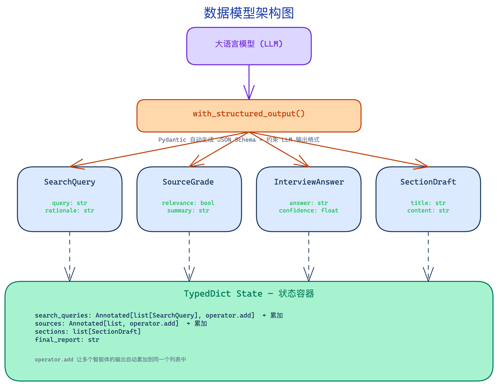
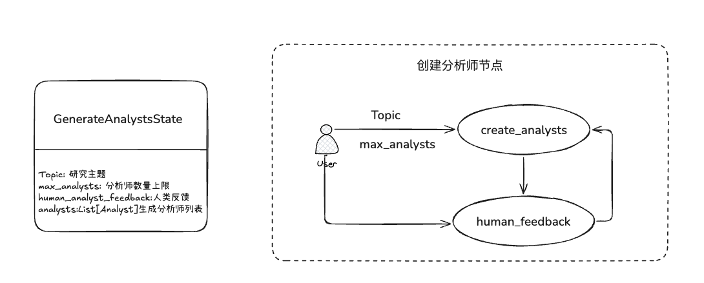
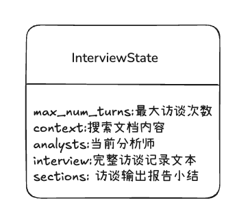
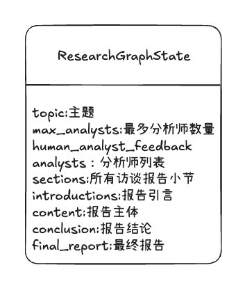

# 阶段1复习
## 数据模型基础
### 1.Pydantic 数据模型 + LLM结构化输出
#### 问题
1. 为什么使用pydantic 而不是普通的dict,提供了什么好处？
Padantic的作用：
1）作为数据校验层，确保LLM返回的数据类型正确；
2）作为function_calling的schema定义，指导LLM按照预定义的结构返回数据，可以自动生成JSON Schema。这个Schema正是 with_structured_output()用来告诉LLM需要返回什么结构的依据。
2. with_structured_output()这个方法做了什么事情，为什么能保证LLM一定返回我们需要的数据格式？
将Pydantic模型转为openai funtion calling 的 tool schema， LLM返回符合schema的Json输出格式，Lanchian再使用Pydantic自动解析并验证类型，省去了手动解析Json的麻烦和出错风险。
3. 为什么需要Perspectives包装类？
with_structured_output 要求返回单个 Pydantic 对象。用 Perspectives 包装 List[Analyst]，LLM 能明确知道要返回一个包含 analysts 列表的结构，而不是其他格式。
```
你的代码                  OpenAI API                  LLM
   │                         │                         │
   │  Pydantic schema        │                         │
   │ ───────────────────→  function calling           │
   │                       的 tools 参数               │
   │                         │ ─────────────────────→  │
   │                         │                         │
   │                         │    LLM 生成符合 schema   │
   │                         │    的 JSON 输出          │
   │                         │ ←─────────────────────  │
   │                         │                         │
   │  Pydantic 自动解析       │                         │
   │  并校验类型               │                         │
   │ ←───────────────────    │                         │
```
```
Pydantic 模型 ──── LLM 的"输出合同"
    │  用 Field(description=...) 告诉 LLM 每个字段填什么
    │  用 with_structured_output() 强制执行
    │
    ├── Analyst      4字段 + @property persona
    ├── Perspectives 容器类，包装 List[Analyst]
    └── SearchQuery  最简单的单字段模型，对话→搜索词, 直接传给搜索引擎。

    底层原理：Pydantic schema → function calling tool → LLM 返回 JSON → Pydantic 解析

```
4. 输出模型使用Pydantic,状态模型使用TypeDict，有什么好处？
TypeDict模型用于工作流节点之间传递状态，轻量，运行时不验证，仅在声明时做类型提示。Pydantic 管 LLM 输入输出，TypedDict 管工作流内部状态。
```
Pydantic (BaseModel)          TypedDict
─────────────────             ──────────
用途：LLM 的输入/输出 schema    用途：工作流节点之间传递的状态
特点：严格的类型校验             特点：轻量，只是类型提示
验证：会报错如果类型不对          验证：运行时不校验，只是声明

Analyst ← Pydantic             ResearchGraphState ← TypedDict
   ↑ LLM 需要严格的 schema         ↑ 节点之间传递，灵活性更重要
   ↑ Field(description=...)         ↑ 用 Annotated[list, operator.add] 做累加
     告诉 LLM 填什么                   告诉 LangGraph 怎么合并
```
5. operator.add——状态累加的秘密武器
当多个节点返回同一字段，普通字段会被覆盖，Annotated累加字段则做+合并。
在 Deep Research 项目中，3 个分析师**并行**做访谈，每个分析师产出一个报告小节：
```
分析师1 → write_section → {"sections": ["AI诊断的进展..."]}
分析师2 → write_section → {"sections": ["AI伦理的挑战..."]}
分析师3 → write_section → {"sections": ["AI成本的分析..."]}
                                      ↓
                    sections 字段自动累加为:
                    ["AI诊断的进展...", "AI伦理的挑战...", "AI成本的分析..."]
                                      ↓
                         write_report 节点拿到完整列表，生成最终报告
```
**如果没有 operator.add，** 你需要手动写代码合并 3 个并行节点的输出。有了它，LangGraph 自动帮你做。
结论： "当多个并行节点返回同名 list 字段时，LangGraph 自动用 + 合并而不是覆盖。这是 Map-Reduce 模式实现并行结果聚合的核心机制。"
**MessagesState 是 LangGraph 提供的特殊状态类，它的 messages 字段默认使用 operator.add。**
#### 架构图:


### 2.三个状态模型

#### 2.1分析师生成状态
**数据流：**
```
用户输入 topic + max_analysts
    ↓
create_analysts 节点读取 topic，生成 analysts
    ↓
human_feedback 节点，人类可修改 human_analyst_feedback
    ↓
如果有反馈 → 回到 create_analysts，重新生成 analysts
```


#### 2.2 访谈子图状态



#### 2.3 全局状态图


