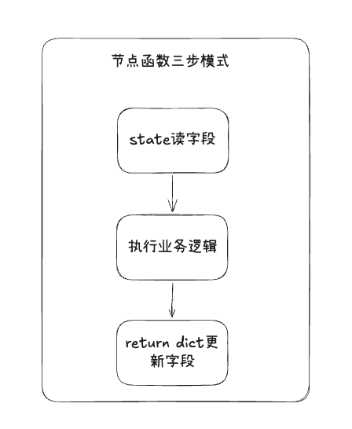
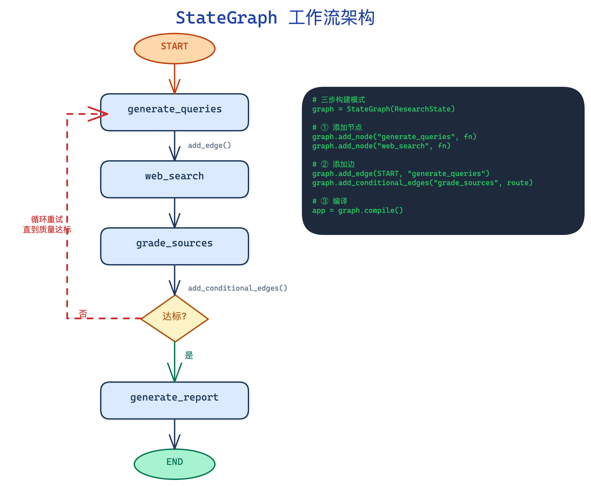

## StateGraph
StateGraph 把工作流建模为有向图，节点是函数(接受状态，返回更新)，边是数据流。编译后通过 invoke 触发执行。
- **节点（node）** = 函数，接收状态，返回状态更新
- **边（edge）** = 数据流向，定义节点之间的执行顺序
- **START / END** = LangGraph 内置的特殊节点，标记入口和出口
### 1.节点函数三步模式

```python
def 节点名(state: 状态类型):
    # 第一步：从 state 中读取需要的字段
    topic = state['topic']

    # 第二步：执行业务逻辑（通常是调用 LLM）
    result = llm.invoke(...)

    # 第三步：返回 dict，只包含需要更新的字段
    return {"字段名": result}
```

### 2.静态边和条件边
普通 edge 是静态连接——A 执行完一定到 B；conditional edge 是动态路由——A 执行完后调用一个 router函数，根据返回值决定下一步去哪个节点。
```python
# 固定边：A 执行完一定走 B
builder.add_edge("A", "B")

# 条件边：A 执行完，根据条件走 B 或 C
builder.add_conditional_edges(
    "A",                    # 从哪个节点出发
    should_continue,        # 路由函数，返回节点名字符串
    ["create_analysts", END] # 可能的目标节点列表
)
```
### 3.架构图


## langfuse

### 1.Trace / Span / Score 三层结构
Trace 是一次完整的请求链路，比如调用 graph.invoke 的整个过程。Span 是链路中的具体步骤，比如每次 LLM 调用的输入输出、token 消耗和延迟。通过 Trace 和 Span 的组合，可以看到从宏观到微观的全链路执行情况。

```
Trace（追踪）—— 一次完整的用户请求
  │
  ├── Span（跨度）—— 一个具体的步骤
  │     ├── 节点执行
  │     ├── LLM 调用
  │     └── 搜索请求
  │
  └── Score（评分）—— 对这次请求的质量评价
        ├── 用户反馈（点赞/点踩）
        └── 自动评分（LLM-as-a-Judge）
```

以工作流为例：
```
用户输入："AI在医疗领域的应用"
    ↓
[开始] 整个函数被调用
    ↓
[处理] LLM 接收 prompt → 生成分析师列表
    ↓
[结束] 返回结果给用户
```
对应的langfuse中显示：
```
Trace: run_research("AI在医疗领域的应用")
  │
  ├── Span 1: create_analysts 节点执行
  │     ├── 构建 system_message
  │     ├── LLM 调用（这是一个子 Span）
  │     │     ├── 输入: prompt 内容
  │     │     └── 输出: 分析师 JSON
  │     └── 解析返回结果
  │
  └── Span 2: human_feedback 节点执行
        └── (等待用户输入)

```
**Trace**: 从用户发起请求到收到最终响应的完整过程。记录了什么时候开始的，什么时候结束的，总耗时多少，总的token消耗是多少，最终的输入输出是什么？

**Span**：Trace内部的每个具体步骤.
Span记录的内容有：
1）LLM调用，最常见的Span
- 输入prompt
- 输出 response
- token消耗（输入+输出）
- 延迟时间（用了多久）
- 使用的模型
2）自定义函数执行-用@observe装饰的函数
- 函数输入参数
- 函数返回值
- 执行耗时
3）搜索请求
- 搜索关键词
- 搜索结果数量
- 搜索耗时

### 2.接入方式
#### 2.1 CallbackHandler
```python
from langfuse.langchain import CallbackHandler

#创建CallbackHandler实例
langfuse_handler = CallbackHandler()

# 传给 LangGraph 的 config，自动追踪每个 LLM 调用
result = graph.invoke(input, config={"callbacks": [langfuse_handler]})
```
自动记录每次 LLM 调用的输入、输出、token 消耗、延迟。你不需要写任何额外代码。

#### 2.2 @observe装饰器（手动追踪自定义函数）
```python
from langfuse import observe

@observe()
def my_function(input_text):
    # 这个函数的调用会被记录为一个 Trace
    return "result"
```
**效果：** 被装饰的函数自动变成一个 Trace，函数内的每次 LLM 调用自动变成 Span。
我们用 Langfuse CallbackHandler 自动追踪 LangGraph 中每一步 LLM 调用，对关键业务函数额外使用@observe装饰器实现精细追踪。