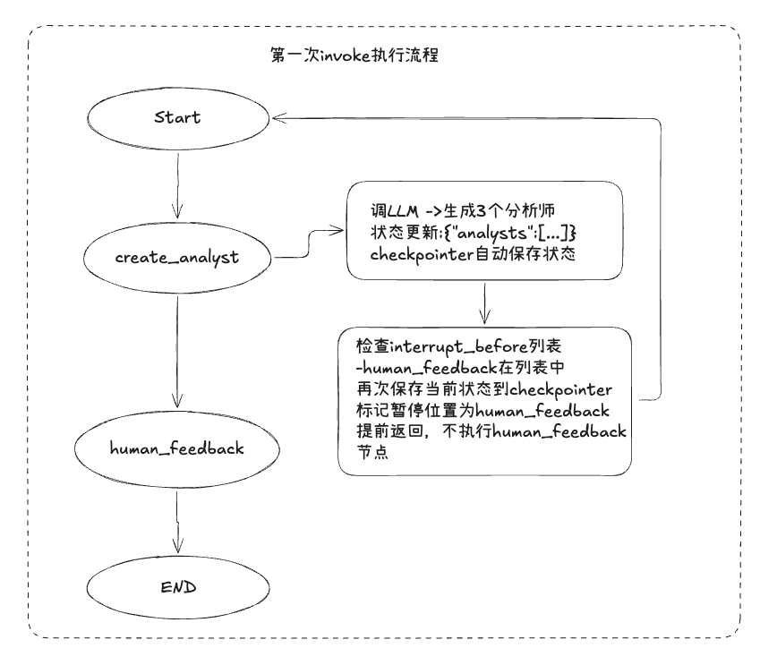
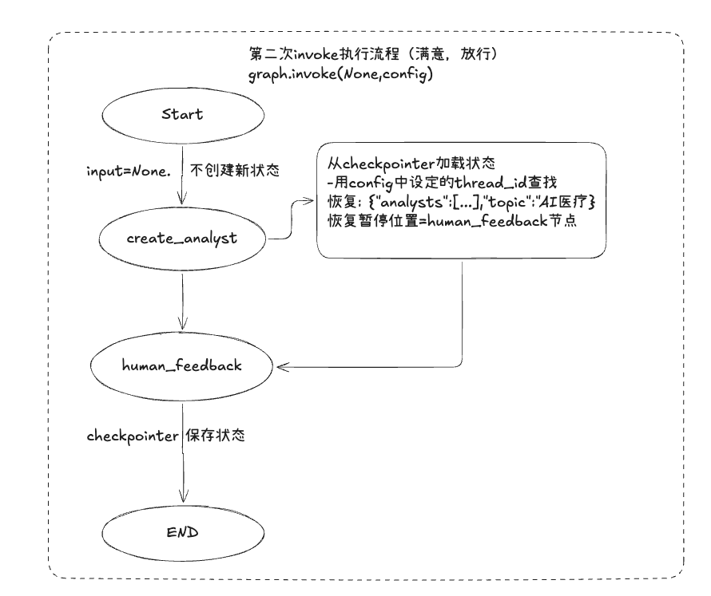
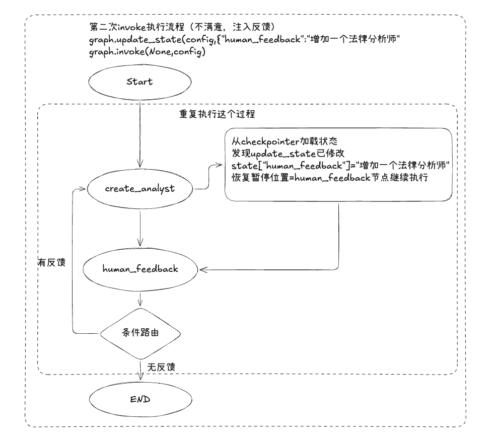

### 条件路由与Human_feedback

#### 1.条件路由
条件路由: **不是节点函数**，是一个返回字符串的普通函数。

```python
def should_continue(state: GenerateAnalystsState):
    if state.get('human_analyst_feedback'):
        return "create_analysts"  # 有反馈 → 回去重新生成
    return END                      # 无反馈 → 结束
```
**规则：**
- 返回值必须是节点名字符串或 `END`
- 它读状态但不修改状态
- 它告诉 LangGraph "下一步走哪个节点"

作用在条件边中，执行作为路由函数。
```python
# Day 3 的固定边（今天删掉）
builder.add_edge("human_feedback", END)

# Day 5 的条件边（今天加上）
builder.add_conditional_edges(
    "human_feedback",              # 从哪个节点出发
    should_continue,               # 路由函数
    ["create_analysts", END]       # 所有可能的目标节点
)
```

#### 2.Human_feedback
human_feedback节点，让图**在执行到它之前暂停**。

compile做的事情：
```
1. 构建图结构
2. 注册一个"拦截器"：每次执行节点前检查是否在 interrupt_before 列表中
3. 绑定 checkpointer：每个节点执行后自动保存状态快照
```
invoke做的事情：
```
1. 执行节点前 → 检查是否命中 interrupt_before
2. 命中 → 保存状态到 checkpointer → 提前返回
3. 没命中 → 正常执行节点 → 执行后也保存状态 → 继续下一个节点
```

invoke(None, config) 时做的事：
```
1. input 是 None → 不创建新状态
2. 从 checkpointer 加载上次保存的状态
3. 从暂停位置继续执行
```
本质流程：

```
                    ┌─────────────────────┐
                    │    数据库 / Redis     │
                    │  存储中间状态          │
                    └──────┬──────────────┘
                           │
    ┌──────────────────────┼──────────────────────┐
    │                      │                       │
    ▼                      ▼                       ▼
 请求1: 生成           请求2: 人类审核         请求3: 继续
 ──────────────      ──────────────         ──────────────
 1.调LLM生成分析师    1.从DB读取状态          1.从DB读取状态
 2.存DB:             2.人类看结果            2.注入反馈到状态
   {                 3.人类写反馈            3.调LLM重新生成
     analysts:[...], 4.更新DB:              4.更新DB
     status:"等待审核"   feedback:"加法律"   5.status="完成"
   }                 5.返回"已更新"
 3.返回"暂停"
```


**解法：compile 时配置**
```python
from langgraph.checkpoint.memory import MemorySaver

memory = MemorySaver()
graph = builder.compile(
    interrupt_before=['human_feedback'],  # 注册拦截点，执行到这个节点前暂停
    checkpointer=memory                   # 状态持久化绑定到存储后端
)
```
`human_feedback` 节点本身是空的（`pass`），真正的"暂停"逻辑不是在节点函数里实现的，而是由 __compile 时的 `interrupt_before`__ 和 __checkpointer__ 共同实现的。

**human_feedback执行流程:**

```
时间 →


第一次 invoke:
────────────────────────────────────────────────
graph.invoke({
    "topic": "AI医疗",
    "max_analysts": 3
}, config)

  │
  ├─ 执行 create_analysts 节点
  │    → 调 LLM → 生成 3 个分析师
  │    → 状态更新: {"analysts": [...]}
  │    → checkpointer 自动保存状态（节点执行后）
  │
  ├─ 下一步是 human_feedback...
  │
  ├─ 检查 interrupt_before 列表
  │    → "human_feedback" 在列表中！
  │    → 保存当前状态到 checkpointer（再次保存）
  │    → 标记"暂停位置" = "human_feedback"
  │    → 提前返回，不执行 human_feedback 节点
  │
  ▼ 函数返回，程序控制权交还给调用者


                          （人类审核中...可能几秒、几分钟、几小时）


第二次 invoke（满意，放行）:
────────────────────────────────────────────────
graph.invoke(None, config)

  │
  ├─ input 是 None → 不创建新状态
  │
  ├─ 从 checkpointer 加载状态
  │    → 用 thread_id="test-001" 查找
  │    → 恢复: {"analysts": [...], "topic": "AI医疗"}
  │    → 恢复"暂停位置" = "human_feedback"
  │
  ├─ 从暂停位置继续 → 执行 human_feedback 节点
  │    → 函数体是 pass，什么都不做
  │    → checkpointer 保存状态
  │
  ├─ 下一步 → 条件路由 should_continue
  │    → 检查 state["human_analyst_feedback"]
  │    → 没有反馈（空字符串或 None）
  │    → return END
  │
  ▼ 工作流结束


第二次 invoke（不满意，注入反馈）:
────────────────────────────────────────────────
# 先更新状态
graph.update_state(config, {"human_analyst_feedback": "加一个法律分析师"})

# 再继续
graph.invoke(None, config)

  │
  ├─ 从 checkpointer 加载状态
  │    → 但 update_state 已经修改了:
  │      state["human_analyst_feedback"] = "加一个法律分析师"
  │
  ├─ 从暂停位置继续 → 执行 human_feedback 节点
  │    → pass，什么也不做
  │
  ├─ 下一步 → 条件路由 should_continue
  │    → 检查 state["human_analyst_feedback"]
  │    → 有反馈！→ return "create_analysts"
  │
  ├─ 回到 create_analysts 节点
  │    → 这次 human_feedback 有值了
  │    → LLM 收到: "请加一个法律分析师"
  │    → 重新生成 3 个分析师（包含法律方向的）
  │
  ├─ 又到 human_feedback 前暂停...
  │
  ▼ 等待人类再次审核

```





#### 3.checkpointer原理
1. checkpointer是状态持久化后端，负责保存和加载图的状态快照。
langgraph有多种checkpointer的实现:
```python
# 内存版（开发测试用，进程退出数据丢失）
from langgraph.checkpoint.memory import MemorySaver
memory = MemorySaver()

# 生产环境可以用数据库
# from langgraph.checkpoint.postgres import PostgresSaver
# from langgraph.checkpoint.sqlite import SqliteSaver
```

2. checkpointer存储的数据结构

```json
{
    "thread_id":"test_01",
    "checkpointer":{
        "state":{
            "topic":"AI医疗",
            "max_analysts":"3",
            "human_analyst_feedback":"",
            "analysts":[Analysts(...),...]
        },
        "next":["human_feedback"], #下一个要执行的节点, 从这里继续
        "pending_tasks":[], #待执行的任务
        "metadata":{        #元数据
            "source":"interrupt",   #保存原因(interrupt/update/step)
            "step":1,               #执行到那一步了
            "writes":{"create_analysts":{...}} #上一节点输出
        }
    }
}
```
3. checkpointer何时触发保存
每次节点执行后都会保存状态，不仅仅是中断时才保存。这样可以确保任何时刻进程崩溃，都能从最近的检查点恢复。
```
节点执行流程:
─────────────────

  执行节点 A
      │
      ├─ 节点函数返回 {"analysts": [...]}
      │
      ├─ 合并到全局状态
      │
      ├─ ★ checkpointer 保存状态快照 ★    ← 每个节点执行后都会保存
      │
      ├─ 检查是否在 interrupt_before 列表中
      │     │
      │     ├─ 是 → 再保存一次（标记暂停位置）→ 返回
      │     │
      │     └─ 否 → 继续下一个节点
      │
      ▼
  执行节点 B
```
__`get_state` 做了什么：__

```python
state = graph.get_state(config)

state.values        # 当前完整状态 dict
state.next          # 下一个要执行的节点名（列表）
state.config        # 当前配置

# 示例
print(state.values["analysts"])   # [Analyst(...), Analyst(...), Analyst(...)]
print(state.next)                  # ['human_feedback'] — 说明暂停在 human_feedback 前
```

1. 用 `config` 中的 `thread_id` 去 checkpointer 查找
2. 加载保存的状态
3. 返回 `StateSnapshot` 对象


__`update_state` 做了什么：__

1. 从 checkpointer 加载当前状态
2. 用传入的字典更新状态（只改指定字段）
3. 保存回 checkpointer


面试: 
1. "langraph中human_in_the_loop的实现原理"：
"LangGraph 通过三个组件配合实现人机协同：

1) __interrupt_before__：在指定节点前拦截，不执行该节点，而是把当前状态保存下来并返回给调用者。

2) __checkpointer__：状态持久化后端。每个节点执行后自动保存状态快照，**中断时额外保存暂停位置**。恢复时用 thread_id 加载状态。

3) __invoke(None, config)__：传 None 表示不更新状态，从上次暂停的检查点继续执行。配合 update_state 可以注入人类反馈。
这种设计的好处是进程不需要一直挂着等人类，可以安全退出，适合生产环境的 HTTP 服务架构。"


**面试考点：**
- interrupt_before 不是暂停代码执行，而是把状态存到 checkpointer，下次用同一 thread_id 恢复
- 生产环境中，暂停和恢复可能是不同进程（Web 服务 A 暂停，Web 服务 B 恢复）
两次调用可能在不同的HTTP请求中，通过config中的thread_id关联

**Q1: "interrupt_before 和直接写 input() 有什么区别？"**
> interrupt_before 配合 checkpointer 实现状态持久化。暂停后进程可以安全退出，下次用同一 thread_id 调用就能恢复。input() 只能用于本地脚本，进程退出状态就丢了。

**Q2: "update_state 和直接传新输入有什么区别？"**
> update_state 是原地修改已有状态中的某个字段（比如只改 human_analyst_feedback），不影响其他字段。直接传新输入会覆盖整个输入。update_state 更适合"微调"而不是"重来"。

**Q3.interrupt_before 和 interrupt_after 的区别是什么？ 在 Deep Research 系统中，为什么选择 interrupt_before 而不是interrupt_after？**
> interrupt_before 让流程在关键节点前暂停，人工审查后再决定是否继续或修改，实现可控的人机协同。

**Q4. 当执行被中断后，怎么恢复执行？ 第二次 invoke() 时传入什么参数？如果用户想修改 State 中的数据，应该怎么做？**
> 恢复流程的三步口诀：查（checkpointer 快照）→ 改（update_state）→ 继（invoke(None)）。面试时把这三步说清楚就够了。